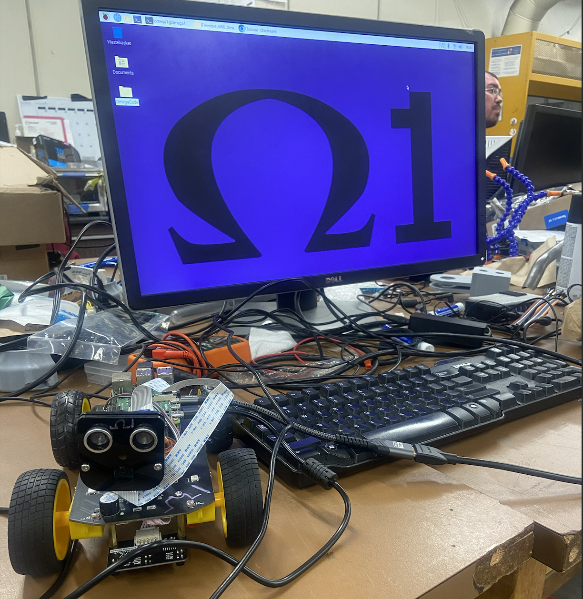
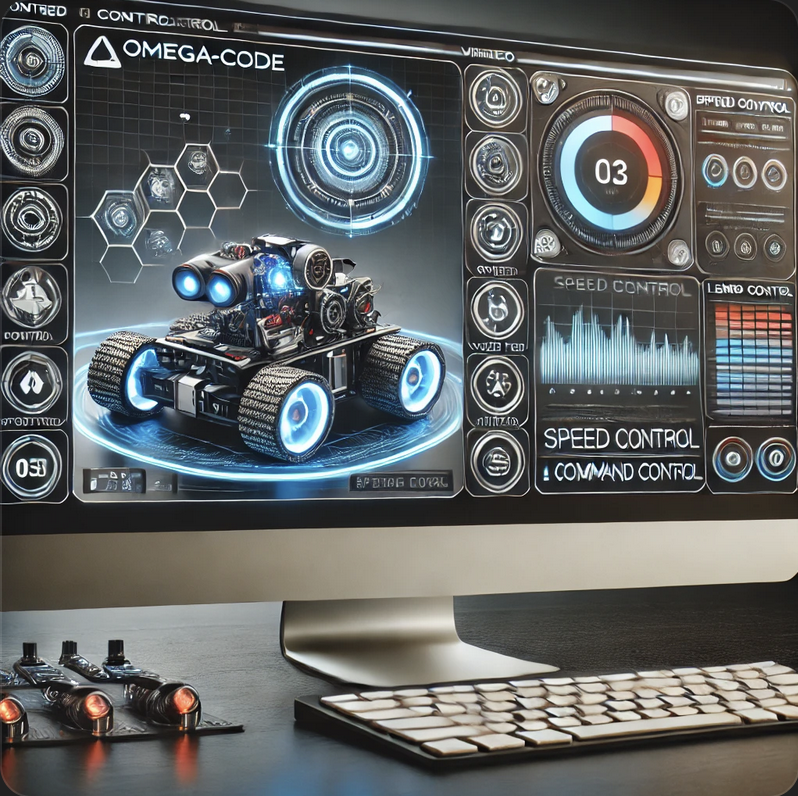

# Omega-Code

Omega-Code is a comprehensive project aimed at developing a fully-featured robot controller interface. The project integrates a backend server for handling robot commands and a frontend user interface for controlling the robot's movements, camera, and LED lights. The project is structured to facilitate ease of use and maintainability, with clear separation of concerns between the backend and frontend components.




## Project Structure

The project is organized into several directories:

- **config**: Contains configuration files necessary for the project.
- **scripts**: Contains shell scripts for connecting to a hotspot.
- **servers**: Contains the backend server code for handling robot commands.
- **ui**: Contains the frontend user interface code for the robot controller.
- **ros**: Contains ROS nodes and scripts for various functionalities including path planning, sensor fusion, and autonomous driving.
- **machine_learning**: Contains machine learning models and scripts for robot navigation.

## Backend Server

The backend server, written in Go, handles incoming HTTP and WebSocket requests to control the robot. It includes command execution for movements, speed control, servo control, and LED control.

## Key Backend Files

### PCA9685

- **PCA9685 Control**: `PCA9685.py` - Controls the PCA9685 PWM driver.

### LED Control

- **LED Control**: `led_control.py` - Manages the LED lights on the robot.

### Servo Control

- **Servo Control**: `servo_control.py` - Controls the servo motors.

### ADC

- **ADC**: `adc.py` - Handles analog to digital conversion.

### Main Application

- **Main Application (Go)**: `main.go` - Entry point of the backend server.
- **Main Application (Python)**: `main.py` - Entry point of the Python backend server.

### Line Tracking

- **Line Tracking**: `line_tracking.py` - Manages the line tracking functionality.

### Threading Control

- **Threading Control**: `threading_control.py` - Manages threading for concurrent tasks.

### Ultrasonic Sensor

- **Ultrasonic Sensor**: `ultrasonic_sensor.py` - Controls the ultrasonic sensor for distance measurement.

### Command Definitions

- **Command Definitions**: `command_definitions.py` - Defines commands for the robot.

### Mock PCA9685

- **Mock PCA9685**: `mock_pca9685.py` - Mock implementation of PCA9685 for testing.

### Video Server

- **Video Server**: `video_server.py` - Handles video streaming from the robot.

### Certificates and Logs

- **Certificates Directory**: `certs` - Contains SSL certificates for secure communication.
- **Server CSR**: `server.csr` - Certificate Signing Request file.
- **Server Log**: `server.log` - Log file for server activities.

### Go Modules

- **Go Mod File**: `go.mod` - Go module definitions.
- **Go Sum File**: `go.sum` - Go module dependencies.

### Virtual Environment

- **Virtual Environment**: `venv` - Python virtual environment for dependencies.

## Frontend User Interface

The frontend UI, built with Next.js and React, provides a web-based interface for controlling the robot. Features include a video feed, control panels, speed control, command log, and LED control.

## Key Files and Components

### Home

- **Main Page**: `src/pages/index.tsx` - Main page integrating all components.

### Command Log Context

- **Context for Logging Commands**: `src/components/CommandLogContext.tsx`

### Control Panel

- **Control Panel**: `src/components/ControlPanel.tsx` - Component for controlling robot movements.

### Speed Control

- **Speed Control**: `src/components/SpeedControl.tsx` - Component for controlling robot speed.

### LED Control

- **LED Control**: `src/components/LedControl.tsx` - Component for controlling LED lights.

### Video Feed

- **Video Feed**: `src/components/VideoFeed.tsx` - Component for displaying video feed.

### Status and Header

- **Header**: `src/components/Header.tsx` - Displays connection status and battery level.
- **Status**: `src/components/Status.tsx` - Displays connection status and battery level.

### LED Modal

- **LED Modal**: `src/components/LedModal.tsx` - Modal for configuring LED settings.

### Lighting Settings

- **Lighting Pattern**: `src/components/LightingPattern.tsx` - Selects lighting patterns.
- **Lighting Mode**: `src/components/LightingMode.tsx` - Selects lighting modes.
- **Interval Timing**: `src/components/IntervalTiming.tsx` - Sets interval timing for LED patterns.

### Control Buttons

- **Control Buttons**: `src/components/ControlButtons.tsx` - Start, stop, and apply settings buttons.

### Color Selection

- **Color Wheel**: `src/components/ColorWheel.tsx` - Color selection using a color wheel.

### Command Definitions

- **Command Definitions**: `control_definitions.ts` - Command definitions used throughout the project.

## ROS Integration

The ROS directory contains nodes and scripts for various functionalities including path planning, sensor fusion, and autonomous driving. Key functionalities include:

### A* Path Planning

- **A* Path Planning**: `a_star.py` - Implements the A* algorithm for path planning.
- **A* ROS Node**: `a_star_ros.py` - ROS node for A* path planning.

### RRT Path Planning

- **RRT Path Planning**: `rrt.py` - Implements the RRT algorithm for path planning.
- **RRT ROS Node**: `rrt_ros.py` - ROS node for RRT path planning.

### D* Lite Path Planning

- **D* Lite Path Planning**: `d_star_lite.py` - Implements the D* Lite algorithm for dynamic path planning.
- **D* Lite ROS Node**: `d_star_lite_ros.py` - ROS node for D* Lite path planning.

### Autonomous Driving

- **Autonomous Driving**: `autonomous_driving.py` - Handles autonomous driving using machine learning.
- **Autonomous Driving with A***: `autonomous_driving_with_astar.py` - Combines A* path planning with autonomous driving.

### Sensor Fusion

- **Sensor Fusion**: `sensor_fusion.py` - Fuses data from multiple sensors and publishes the fused data.

### Sensor Publishing

- **Camera Publisher**: `camera_publisher.py` - Captures video from the camera and publishes as ROS messages.
- **Line Tracking Publisher**: `line_tracking_publisher.py` - Reads line tracking sensor data and publishes as ROS messages.
- **Ultrasonic Publisher**: `ultrasonic_publisher.py` - Reads distance data from an ultrasonic sensor and publishes as ROS messages.

### Miscellaneous

- **Battery Monitor**: `battery_monitor.py` - Monitors battery status and sends alerts if low.
- **Log Sensor Data**: `log_sensor_data.py` - Logs data from various sensors for later analysis.
- **Start Sensors**: `start_sensors.py` - Manages the startup of sensor nodes based on configuration.
- **Visualize Sensor Data**: `visualize_sensor_data.py` - Visualizes data from various sensors in real-time using Matplotlib.

## Testing

The repository includes a comprehensive set of tests organized into unit tests, integration tests, and end-to-end tests for both ROS nodes and scripts, as well as the robot controller frontend and backend.

### Unit Tests

- **Unit Tests**: Located in `tests/unit`, these tests cover individual components of the backend, frontend, and ROS nodes.

### Integration Tests

- **Integration Tests**: Located in `tests/integration`, these tests cover interactions between components of the backend, frontend, and ROS nodes.

### End-to-End Tests

- **End-to-End Tests**: Located in `tests/e2e`, these tests cover the full system functionality for the backend, frontend, and ROS nodes.

## Scripts

### Connect Laptop to Phone Hotspot Scripts

- **Connect Hotspot v1**: `connect_hotspot_v1.sh` - Script for connecting the robot to a hotspot (version 1).
- **Connect Hotspot v2**: `connect_hotspot_v2.sh` - Script for connecting the robot to a hotspot (version 2).
- **Connect PAN**: `connect_pan.sh` - Script for connecting the robot to a PAN (Personal Area Network).
- **Start Robot**: `start_robot.sh` - Script for starting the robot system.

## Getting Started

### Prerequisites

- Node.js
- Go
- Python
- ROS


### Installation

1. Install backend dependencies:
   ```bash
   cd servers/robot-controller-backend
   go get ./...
   ```
2. Install frontend dependencies:
   ```bash
   cd ui/robot-controller-ui
   npm install
   ```
3. Set up environment variables:
   Create a `.env` file in the `servers/robot-controller-backend` directory with the following variables:
   ```env
   CERT_PATH=/path/to/cert.pem
   KEY_PATH=/path/to/key.pem
   ```

### Running the Project

1. Start the backend server:
   ```bash
   cd servers/robot-controller-backend
   go run main.go
   ```
2. Start the frontend development server:
   ```bash
   cd ui/robot-controller-ui
   npm run dev
   ```

### Usage

Open a web browser and navigate to `http://localhost:3000` to access the robot controller interface. If you have configured HTTPS, use `https://localhost:3000` instead. Use the provided controls to send commands to the robot.

## Acknowledgements

Special thanks to Freenove for providing the **Freenove 4WD Smart Car Kit for Raspberry Pi** and their comprehensive support.

### Freenove 4WD Smart Car Kit for Raspberry Pi

> A 4WD smart car kit for Raspberry Pi.


#### Download

- **Use command in console:**
  ```bash
  git clone https://github.com/Freenove/Freenove_4WD_Smart_Car_Kit_for_Raspberry_Pi.git
  ```
- **Manually download in browser:**
  Click the green "Clone or download" button, then click "Download ZIP" button in the pop-up window.

For any difficulties, please contact Freenove support at [support@freenove.com](mailto:support@freenove.com).

#### Support

Freenove provides free and quick customer support, including but not limited to:

- Quality problems of products
- Using problems of products
- Questions of learning and creation
- Opinions and suggestions
- Ideas and thoughts

#### Purchase

Visit [Freenove Store](http://store.freenove.com) to purchase their products. For business inquiries, contact [sale@freenove.com](mailto:sale@freenove.com).

#### Copyright

All files in the Freenove repository are released under [Creative Commons Attribution-NonCommercial-ShareAlike 3.0 Unported License](http://creativecommons.org/licenses/by-nc-sa/3.0/).


Freenove brand and logo are copyright of Freenove Creative Technology Co., Ltd. Can't be used without formal permission.

#### About Freenove

Freenove is an open-source electronics platform committed to helping customers quickly realize creative ideas and product prototypes. They offer robot kits, learning kits for Arduino, Raspberry Pi, and micro:bit, electronic components and modules, tools, and product customization services.

## License

This project is licensed under the MIT License.



