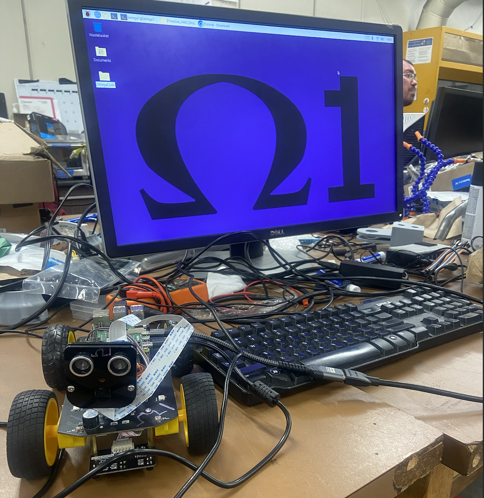
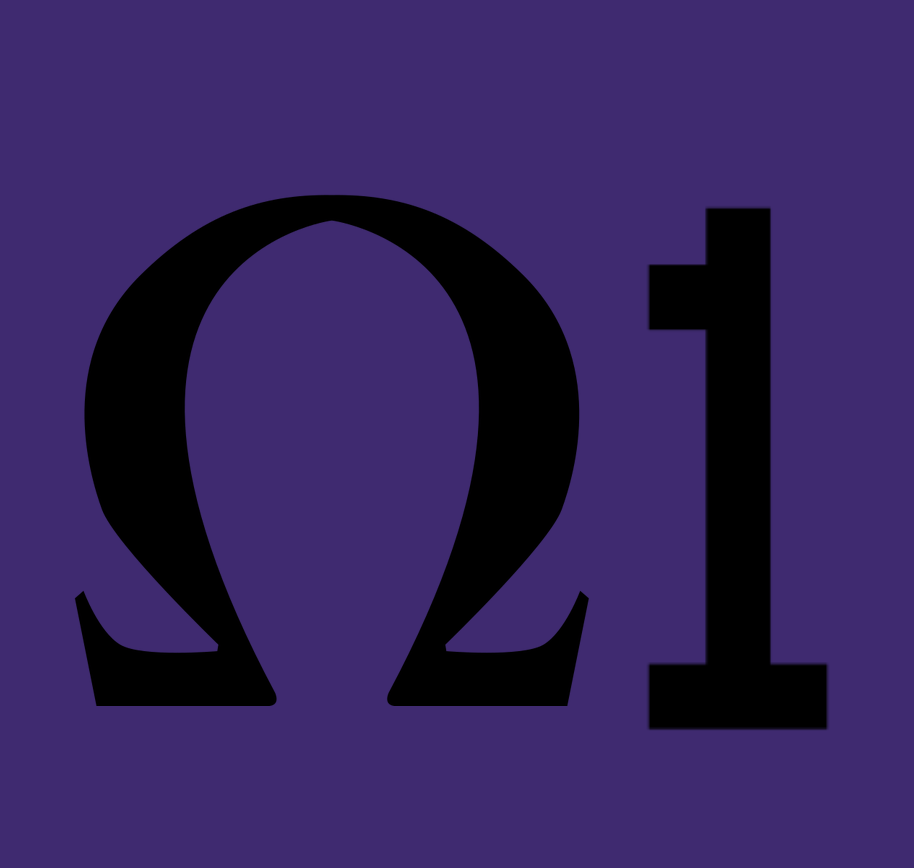

# Omega-1 — Hybrid ROS2 Robotics Platform

<p align="center">
  
  <br/>
  
</p>

Omega-1 is a modular autonomous robotics platform built around a Raspberry Pi 4B and a
Freenove 4WD chassis. It runs a **hybrid architecture**: a Next.js web UI and FastAPI
backend handle operator interaction, while ROS2 (Humble) handles motor control, sensor
integration, servo pan-tilt, and autonomous operation.

---

## System Architecture

```
[Next.js UI]  http/ws
     |
     |--/api/video-proxy --> MJPEG stream (same-origin proxy, avoids CORS)
     |
[FastAPI]  port 8000    <-- OmegaRosBridge embeds rclpy node here
     |  publishes /cmd_vel_in (Twist)
     |  ROS2 DDS (CycloneDDS)
     |
+----+----------------------------------------------+
|               Raspberry Pi 4B                     |
|   ROS2 Node Graph (omega_hybrid.launch.py)        |
|                                                    |
|   xbox_teleop          --> /cmd_vel_in             |
|   (evdev, daemon thread)--> /omega/servo_increment |
|                                                    |
|   FastAPI ROS bridge   --> /cmd_vel_in             |
|                                                    |
|   obstacle_avoidance_node <-- /cmd_vel_in          |
|   (ultrasonic mux)        <-- /omega/ultrasonic    |
|        PASS_THROUGH / WARN / PIVOTING state machine|
|                           --> /cmd_vel             |
|                                                    |
|   motor_controller   <-- /cmd_vel                 |
|         |                --> /odom                 |
|         |                --> /omega/motor_state    |
|         v                --> /tf  (odom->base_link)|
|      PCA9685 (I2C 0x40)                           |
|      4WD motor HAL                                |
|                                                    |
|   sensor_node             --> /omega/ultrasonic    |
|   (HC-SR04, IR, ADS1115)  --> /omega/line_tracking/*|
|                            --> /omega/battery      |
|                                                    |
|   servo_controller   <-- /omega/servo_increment   |
|         |                --> /omega/servo_state    |
|         v                                          |
|      PCA9685 ch8/ch9  (pan-tilt gimbal)           |
|                                                    |
|   video/video_server.py   (Flask, port 5000)      |
|   GStreamer libcamerasrc pipeline                  |
|   CSI OV5647            --> MJPEG /video_feed     |
|                          --> /health               |
|                                                    |
|   omega_camera/camera_node  (ROS2)                |
|   (libcamerasrc GStreamer pipeline)               |
|   CSI OV5647                --> /omega/camera/image_raw       |
|                             --> /omega/camera/image_raw/compressed|
|                                                    |
|   system_capabilities     --> /omega/capabilities  |
|   static_tf               --> base_link->camera_link|
|                            --> base_link->ultrasonic_front|
+---------------------------------------------------+
         |
         | CycloneDDS (Tailscale)
         v
+---------------------------------------------------+
|             Jetson Orin (future)                  |
|   omega_detection/detection_node                  |
|   <-- /omega/camera/image_raw/compressed          |
|   --> /omega/detections  (Detection2DArray)       |
|   --> /omega/camera/annotated/compressed          |
+---------------------------------------------------+

Non-ROS (managed separately by OmegaOS / systemd):
  FastAPI REST/WS       http://omegaone:8000
  Go lighting server    ws://omegaone:8082
  MJPEG video stream    http://omegaone:5000   (proxied via /api/video-proxy)

Multi-machine DDS (CycloneDDS):
  Pi (omegaOne) <--> Laptop <--> Jetson Orin (Tailscale)
```

### TF Tree

```
odom
 └── base_link          (dynamic: motor_controller @ 50 Hz)
      ├── camera_link   (static: 8 cm fwd, 10 cm up)
      └── ultrasonic_front  (static: 12 cm fwd)
```

### ROS Topic Map

| Topic | Type | Hz | Producer |
|---|---|---|---|
| `/cmd_vel_in` | `geometry_msgs/Twist` | on-demand | FastAPI bridge, xbox_teleop |
| `/cmd_vel` | `geometry_msgs/Twist` | on-demand | obstacle_avoidance_node (mux) |
| `/odom` | `nav_msgs/Odometry` | 50 | motor_controller_node |
| `/omega/motor_state` | `omega_interfaces/MotorState` | 10 | motor_controller_node |
| `/omega/ultrasonic` | `sensor_msgs/Range` | 10 | sensor_node |
| `/omega/line_tracking/center` | `std_msgs/Bool` | 20 | sensor_node |
| `/omega/battery` | `sensor_msgs/BatteryState` | 1 | sensor_node |
| `/omega/obstacle_avoidance/state` | `std_msgs/String` (JSON) | 20 | obstacle_avoidance_node |
| `/omega/camera/image_raw` | `sensor_msgs/Image` (bgr8) | 10 | omega_camera/camera_node |
| `/omega/camera/image_raw/compressed` | `sensor_msgs/CompressedImage` | 10 | omega_camera/camera_node |
| `/omega/servo_increment` | `geometry_msgs/Vector3` | on-demand | xbox_teleop / web UI |
| `/omega/servo_state` | `std_msgs/String` (JSON) | 1 | servo_controller_node |
| `/omega/capabilities` | `std_msgs/String` (JSON) | 0.2 | system_capabilities |
| `/omega/detections` | `vision_msgs/Detection2DArray` | ~10 | detection_node *(Jetson, future)* |

---

## Repository Structure

```
Omega-Code/
├── setup.py                        # pip install -e . makes servers/ importable
├── ros/
│   └── src/
│       ├── omega_robot/            # Core ROS nodes
│       │   └── omega_robot/
│       │       ├── motor_controller_node.py
│       │       ├── sensor_node.py
│       │       ├── servo_controller_node.py
│       │       ├── xbox_teleop_node.py      # publishes /cmd_vel_in
│       │       ├── ultrasonic_avoidance_node.py  # cmd_vel mux
│       │       ├── camera_debug_node.py
│       │       ├── system_capabilities.py
│       │       └── ... (action servers, path planner, orin_ai_brain)
│       ├── omega_camera/           # Camera pipeline (separate package)
│       │   └── omega_camera/
│       │       └── camera_node.py  # libcamerasrc → OpenCV → ROS2
│       ├── omega_detection/        # Perception / YOLO (in development)
│       │   └── omega_detection/
│       │       └── detection_node.py
│       ├── omega_bringup/          # Launch files + CycloneDDS config
│       │   ├── launch/
│       │   │   ├── omega_hybrid.launch.py   # full stack on Pi
│       │   │   ├── omega_minimal.launch.py  # motor + sensors only
│       │   │   └── omega_sim.launch.py      # sim mode (no hardware)
│       │   └── config/
│       │       ├── cyclonedds_pi.xml
│       │       └── cyclonedds_laptop.xml
│       └── omega_interfaces/       # Custom msg / srv / action types
│           ├── msg/MotorState.msg
│           └── ...
└── servers/
    └── robot_controller_backend/
        ├── movement/               # Motor HAL: PCA9685, ramp, PID, odometry
        ├── sensors/                # HC-SR04, IR, ADC
        ├── video/
        │   ├── video_server.py     # Flask MJPEG server (port 5000)
        │   └── camera.py           # GStreamer/libcamerasrc Camera class
        ├── api/
        │   ├── ros_bridge.py       # FastAPI <-> ROS2 bridge (publishes /cmd_vel_in)
        │   ├── sensor_bridge.py    # ROS subscriber → WebSocket fan-out
        │   └── sensor_ws_routes.py # /ws/ultrasonic, /ws/line, /ws/battery
        └── main_api.py             # FastAPI entry point

scripts/
└── setup_pi_camera.sh              # One-shot Pi camera stack bootstrap
```

---

## Hardware

| Component | Details |
|---|---|
| Compute | Raspberry Pi 4B (4 GB) |
| Chassis | Freenove 4WD smart car |
| Motor driver | PCA9685 PWM hat (I2C 0x40) |
| Motors | 4× DC gear motors — ch0–7 |
| Pan-tilt | 2-axis servo gimbal — PCA9685 ch8 (yaw), ch9 (pitch) |
| Ultrasonic | HC-SR04 (GPIO 27 trig / GPIO 22 echo) |
| Line tracking | 3× IR sensors (GPIO 14/15/23) |
| Battery ADC | ADS1115 (I2C 0x48) |
| Camera | CSI OV5647 (via libcamera + GStreamer) |
| Controller | Xbox One S/X wireless (via xpad or Bluetooth) |

### Motor Channel Map (Freenove Ordinary_Car)

| Wheel | Forward ch | Backward ch |
|---|---|---|
| Left upper (front-left) | ch1 | ch0 |
| Left lower (rear-left) | ch2 | ch3 |
| Right upper (front-right) | ch7 | ch6 |
| Right lower (rear-right) | ch5 | ch4 |

STOP = set both channels of a wheel to 4095.

---

## Requirements

### All Machines
- ROS2 Humble Hawksbill
- Python 3.10+
- `sudo apt install ros-humble-rmw-cyclonedds-cpp`

### Raspberry Pi 4B
- Ubuntu 22.04 Server (64-bit)
- `sudo apt install python3-lgpio python3-smbus`
- `sudo apt install ros-humble-cv-bridge python3-opencv`
- Xbox controller: `sudo usermod -aG input $USER && pip install evdev`
- libcamera built from source (see [Camera Setup](#camera-setup) below)
- Hardware: PCA9685 (I2C 0x40), HC-SR04 (GPIO 27/22), IR sensors (GPIO 14/15/23), ADS1115 (I2C 0x48)

### Development Laptop
- Ubuntu 22.04 Desktop
- `sudo apt install ros-humble-desktop`
- Node.js 18+ (for UI development)

### Jetson Orin (detection node — future)
- JetPack 5.x + ROS2 Humble
- `sudo apt install ros-humble-vision-msgs`
- PyTorch + Ultralytics YOLOv8 + TensorRT
- Tailscale for VPN connectivity to Pi

---

## Camera Setup

The CSI OV5647 requires libcamera 0.7.0 with a GStreamer plugin. The Ubuntu apt package is
incomplete on ARM64 — libcamera must be built from source and installed to system paths.

### Automated setup (recommended)

```bash
# Run once on a fresh Pi — handles all system-level changes:
chmod +x scripts/setup_pi_camera.sh
./scripts/setup_pi_camera.sh
source ~/.bashrc
```

The script covers:
1. `apt install python3-opencv` (replaces pip opencv-python which lacks GStreamer support)
2. `pip3 install "numpy<2"` (cv_bridge compiled against NumPy 1.x)
3. Blacklists `bcm2835_v4l2` kernel module (conflicts with libcamera at boot)
4. Installs libcamera `.so` files, GStreamer plugin, IPA modules, tuning JSONs to `/usr/local/`
5. Creates shared-library symlinks in `/usr/local/lib/` (ldconfig requires these)
6. Writes `/etc/ld.so.conf.d/libcamera-local.conf` and runs `ldconfig`
7. Appends env vars to `~/.bashrc` (idempotent)

### Build libcamera from source (Pi only, one-time)

```bash
# Dependencies
sudo apt install meson ninja-build python3-jinja2 python3-ply \
  libgstreamer1.0-dev libgstreamer-plugins-base1.0-dev \
  libglib2.0-dev libyaml-dev libssl-dev

# Clone and build
git clone https://git.libcamera.org/libcamera/libcamera.git ~/libcamera
cd ~/libcamera && git checkout v0.7.0
meson setup build \
  -Dpipelines=rpi/vc4 \
  -Dipas=rpi/vc4 \
  -Dgstreamer=enabled \
  -Dtest=false \
  -Ddocumentation=disabled
ninja -C build

# Install to /usr/local/ (setup_pi_camera.sh automates this)
sudo cp build/src/libcamera/libcamera*.so* /usr/local/lib/
sudo cp build/src/libcamera/libcamera*.so* /usr/local/lib/
sudo cp build/src/gstreamer/libgstlibcamera.so /usr/local/lib/aarch64-linux-gnu/gstreamer-1.0/
sudo ldconfig
```

### Required environment variables (add to `~/.bashrc` on Pi)

```bash
export LD_LIBRARY_PATH=/usr/local/lib:${LD_LIBRARY_PATH:-}
export GST_PLUGIN_PATH=/usr/local/lib/aarch64-linux-gnu/gstreamer-1.0:${GST_PLUGIN_PATH:-}
export LIBCAMERA_IPA_MODULE_PATH=/usr/local/lib/aarch64-linux-gnu/libcamera/ipa
export PYTHONPATH=/usr/local/lib/python3/dist-packages:${PYTHONPATH:-}
```

These must be set in every shell that runs the camera node or video server.
The libcamera log line `"libcamera is not installed"` is expected and harmless; it means
the local build is in use rather than a system install.

### MJPEG video server (UI camera feed)

The web UI streams live video via a Flask server at port 5000. This is separate from the
ROS2 camera node and is the primary feed displayed in the dashboard.

```bash
# Start the video server on the Pi
cd ~/Desktop/Omega-Code/servers/robot_controller_backend/video
python3 video_server.py
# Stream available at http://omegaone:5000/video_feed
# Health endpoint:   http://omegaone:5000/health
```

The Next.js UI proxies the stream through `/api/video-proxy` to avoid CORS/mixed-content.
`CameraFrame.tsx` renders it as a plain `` tag (Next.js `<Image>` breaks MJPEG streams).

Configure the Pi's video URL in `ui/robot-controller-ui/.env.local`:
```
NEXT_PUBLIC_VIDEO_STREAM_URL_LAN=http://omegaone:5000/video_feed
```

### Camera node (ROS2)

```bash
# Run standalone (outside the main launch)
ros2 run omega_camera camera_node

# Verify frames are streaming
ros2 topic hz /omega/camera/image_raw        # ~10 Hz
ros2 topic echo /omega/camera/image_raw --field header  # stamp.sec should be non-zero
```

The camera node uses this GStreamer pipeline:
```
libcamerasrc !
video/x-raw,width=640,height=480,framerate=10/1 !
queue leaky=downstream max-size-buffers=1 !
videoconvert ! video/x-raw,format=BGR !
appsink max-buffers=1 drop=true sync=false
```

`queue leaky=downstream` and `appsink drop=true sync=false` prioritise low latency
over completeness — stale frames are dropped rather than buffered.

### Headless debugging (no GUI)

```bash
# Save a frame to disk and SCP it to your laptop
python3 - <<'EOF'
import cv2
cap = cv2.VideoCapture(
    "libcamerasrc ! video/x-raw,width=640,height=480,framerate=10/1 ! videoconvert ! appsink drop=true",
    cv2.CAP_GSTREAMER
)
ret, frame = cap.read()
if ret:
    cv2.imwrite("/tmp/test_frame.jpg", frame)
    print("Saved /tmp/test_frame.jpg")
cap.release()
EOF

scp omega1@omegaOne:/tmp/test_frame.jpg ~/Desktop/
```

---

## Installation

### 1. Clone

```bash
git clone https://github.com/abelxmendoza/Omega-Code.git ~/Desktop/Omega-Code
```

### 2. Install backend as Python package

Makes `servers.robot_controller_backend.*` importable in ROS nodes:

```bash
pip install -e ~/Desktop/Omega-Code/
```

### 3. Create the Colcon workspace

```bash
mkdir -p ~/omega_ws/src
cd ~/omega_ws/src
ln -s ~/Desktop/Omega-Code/ros/src/omega_robot      omega_robot
ln -s ~/Desktop/Omega-Code/ros/src/omega_bringup    omega_bringup
ln -s ~/Desktop/Omega-Code/ros/src/omega_interfaces omega_interfaces
ln -s ~/Desktop/Omega-Code/ros/src/omega_camera     omega_camera
ln -s ~/Desktop/Omega-Code/ros/src/omega_detection  omega_detection
```

### 4. Install ROS dependencies

```bash
source /opt/ros/humble/setup.bash
cd ~/omega_ws
rosdep update
rosdep install --from-paths src --ignore-src -r -y
```

### 5. Build

```bash
cd ~/omega_ws
colcon build --packages-select omega_interfaces
colcon build --packages-select omega_robot omega_bringup omega_camera omega_detection \
  --symlink-install
```

`--symlink-install` means Python edits to node files are live without rebuild.

### 6. Environment (add to `~/.bashrc`)

```bash
source /opt/ros/humble/setup.bash
source ~/omega_ws/install/setup.bash
export ROS_DOMAIN_ID=42
export RMW_IMPLEMENTATION=rmw_cyclonedds_cpp

# Pi:
export CYCLONEDDS_URI=file://$HOME/Desktop/Omega-Code/ros/src/omega_bringup/config/cyclonedds_pi.xml
# Laptop:
# export CYCLONEDDS_URI=file://$HOME/Desktop/Omega-Code/ros/src/omega_bringup/config/cyclonedds_laptop.xml

# Pi only — required for libcamerasrc:
export LD_LIBRARY_PATH=$HOME/libcamera/build/src/libcamera:$LD_LIBRARY_PATH
export GST_PLUGIN_PATH=$HOME/libcamera/build/src/gstreamer:$GST_PLUGIN_PATH
```

Update peer IPs in the CycloneDDS XML files to match your network.

---

## Obstacle Avoidance

The `obstacle_avoidance_node` acts as a `cmd_vel` mux — all velocity commands from the
web UI and Xbox controller flow through it before reaching the motor controller.

```
FastAPI bridge  ──┐
xbox_teleop     ──┤──> /cmd_vel_in ──> obstacle_avoidance_node ──> /cmd_vel ──> motor_controller
                   │                        ^
                   │              /omega/ultrasonic (HC-SR04)
```

**States:**

| State | Condition | Behaviour |
|---|---|---|
| `PASS_THROUGH` | dist > warn_m (0.50 m) | Commands pass through unchanged |
| `WARN` | stop_m < dist ≤ warn_m | Forward speed scaled down proportionally; reverse always passes |
| `PIVOTING` | dist ≤ stop_m (0.25 m) | Stops forward motion, pivots in place; direction alternates each burst |

```bash
# Monitor avoidance state
ros2 topic echo /omega/obstacle_avoidance/state

# Enable / disable at runtime
ros2 topic pub --once /omega/obstacle_avoidance/enable std_msgs/Bool '{data: false}'
```

**Launch overrides:**
```bash
# Disable avoidance (pass-through only)
ros2 launch omega_bringup omega_hybrid.launch.py launch_avoidance:=false

# Tune distances and pivot behaviour
ros2 launch omega_bringup omega_hybrid.launch.py \
  warn_distance_m:=0.60 \
  stop_distance_m:=0.30 \
  pivot_speed:=0.80 \
  pivot_duration_s:=1.0
```

---

## Running the Robot

### Full hybrid stack (Pi, hardware mode)

```bash
# Terminal 1 — ROS2 nodes (motor, sensors, obstacle avoidance, servo, TF)
ros2 launch omega_bringup omega_hybrid.launch.py

# Terminal 2 — MJPEG video server (camera feed for web UI)
cd ~/Desktop/Omega-Code/servers/robot_controller_backend/video
python3 video_server.py

# Terminal 3 — FastAPI backend (movement WS, sensor WS, ROS bridge)
cd ~/Desktop/Omega-Code/servers/robot_controller_backend
python3 main_api.py

# Terminal 4 — ROS2 camera node (optional — for ROS topic subscribers)
ros2 run omega_camera camera_node
```

### Launch overrides

```bash
# Skip servo gimbal
ros2 launch omega_bringup omega_hybrid.launch.py launch_servo:=false

# Disable obstacle avoidance (raw pass-through)
ros2 launch omega_bringup omega_hybrid.launch.py launch_avoidance:=false

# Simulation mode (no hardware I/O)
ros2 launch omega_bringup omega_hybrid.launch.py sim_mode:=true

# Motor + sensors only
ros2 launch omega_bringup omega_minimal.launch.py
```

---

## Xbox Controller (Teleop)

```bash
ros2 run omega_robot xbox_teleop
```

| Input | Action |
|---|---|
| Right Trigger | Drive forward |
| Left Trigger | Drive reverse / brake |
| Left Stick X | Steer (angular.z) |
| Right Stick X/Y | Pan-tilt camera (continuous) |
| D-Pad Left/Right | Pan camera (step) |
| D-Pad Up/Down | Tilt camera (step) |
| A Button (hold) | Emergency stop |

Pure left-stick with no triggers → in-place pivot.

---

## Servo Pan-Tilt

The servo controller listens to `/omega/servo_increment` (`geometry_msgs/Vector3`):
- `x` → yaw delta (positive = right)
- `y` → pitch delta (positive = up)

Values are normalised `[-1.0, 1.0]`. Scaled by `scale_us` (default 15 µs/unit),
clamped to hard limits (yaw 1000–2000 µs, pitch 1300–1700 µs).

```bash
# Pan right
ros2 topic pub --once /omega/servo_increment geometry_msgs/Vector3 '{x: 0.5, y: 0.0}'
# Tilt up
ros2 topic pub --once /omega/servo_increment geometry_msgs/Vector3 '{x: 0.0, y: 0.5}'
# Monitor position
ros2 topic echo /omega/servo_state
```

---

## Manual Motor Control

```bash
# Forward 50%
ros2 topic pub --once /cmd_vel geometry_msgs/Twist \
  '{linear: {x: 0.5}, angular: {z: 0.0}}'

# Rotate left
ros2 topic pub --once /cmd_vel geometry_msgs/Twist \
  '{linear: {x: 0.0}, angular: {z: 0.6}}'

# Stop
ros2 topic pub --once /cmd_vel geometry_msgs/Twist '{}'

# Continuous (10 Hz)
ros2 topic pub --rate 10 /cmd_vel geometry_msgs/Twist \
  '{linear: {x: 0.3}, angular: {z: 0.2}}'
```

---

## Detection Architecture (Pi + Jetson)

The perception pipeline splits across two machines to keep the Pi's CPU free for
real-time control:

```
Pi                                   Jetson Orin
────────────────────                 ─────────────────────────────
camera_node                          detection_node
  /omega/camera/image_raw            <-- /omega/camera/image_raw/compressed
  /omega/camera/image_raw/compressed     (decompress → YOLOv8 TensorRT)
        │                            --> /omega/detections
        │                                (vision_msgs/Detection2DArray)
        │◄────────────────────────────── /omega/detections
        │
decision_node (Pi)
  <-- /omega/detections
  <-- /omega/ultrasonic
  --> /cmd_vel
  --> /omega/servo_increment  (track detected target)
```

Bandwidth: 640×480 JPEG @ 80% ≈ 40–60 KB/frame × 10fps ≈ 400–600 KB/s over Tailscale.

---

## Troubleshooting

### Camera not publishing

```bash
# Check topic exists and is streaming
ros2 topic list | grep camera
ros2 topic hz /omega/camera/image_raw

# Verify libcamerasrc GStreamer plugin is available
gst-inspect-1.0 libcamerasrc

# If gst-inspect fails, env vars are not set:
export LD_LIBRARY_PATH=$HOME/libcamera/build/src/libcamera:$LD_LIBRARY_PATH
export GST_PLUGIN_PATH=$HOME/libcamera/build/src/gstreamer:$GST_PLUGIN_PATH

# Check another process isn't holding the camera
fuser /dev/video0 /dev/media0 2>/dev/null
```

Expected log lines (not errors):
- `"libcamera is not installed"` — harmless, means local build is in use
- `"Cannot query video position"` — harmless GStreamer warning

Do NOT use `/dev/videoX` directly — V4L2 does not work with this CSI camera.

### Nodes on Pi not visible from laptop

1. `echo $ROS_DOMAIN_ID` — must be 42 on both machines
2. `echo $RMW_IMPLEMENTATION` — must be `rmw_cyclonedds_cpp`
3. Peer IPs in `cyclonedds_*.xml` must match actual addresses
4. `<AllowMulticast>false</AllowMulticast>` in CycloneDDS config if on a hotspot

### Camera feed not appearing in UI

```bash
# 1. Verify video server is running on Pi
curl http://omegaone:5000/health   # should return 200

# 2. Verify the proxy URL resolves from your dev machine
curl -I http://localhost:3002/api/video-proxy   # should start streaming

# 3. Check .env.local has correct URL
cat ui/robot-controller-ui/.env.local | grep VIDEO_STREAM

# 4. Restart Next.js dev server after .env.local changes
# (env changes are NOT hot-reloaded)
```

### Motors not responding

```bash
ros2 topic echo /omega/motor_state
# watchdog: true → no /cmd_vel in 500 ms

# If avoidance node is running, check it's passing commands through:
ros2 topic echo /omega/obstacle_avoidance/state

ros2 topic pub --once /cmd_vel_in geometry_msgs/Twist '{}'
```

### I2C / PCA9685 not found

```bash
i2cdetect -y 1   # PCA9685 at 0x40, ADS1115 at 0x48
sudo modprobe i2c-dev
```

### Xbox controller not detected

```bash
ls /dev/input/event*
sudo usermod -aG input $USER   # then log out and back in
pip install evdev
```

### `Package not found` after build

```bash
source /opt/ros/humble/setup.bash
source ~/omega_ws/install/setup.bash
```

### `ImportError: No module named 'servers'`

```bash
pip install -e ~/Desktop/Omega-Code/
```

---

## Known Issues

| Issue | Status |
|---|---|
| Front-left motor (left_upper) sometimes silent | ch0/ch1 wiring swap applied — run `motor_channel_scan.py` to verify channel mapping if still failing |
| Pitch servo jitter at extremes | Hardware slack in gimbal; limits tightened to 1300–1700 µs |
| No wheel encoders | Dead-reckoning odometry only; large covariance in `/odom` until encoders added |
| Camera node not in omega_hybrid.launch.py | Camera is launched separately due to libcamera env var requirement |

---

## Roadmap

### Near-term
- **Detection node** — `omega_detection/detection_node.py` with YOLOv8 on Jetson Orin
- **Wheel encoders** — AS5600 magnetic → accurate `/odom` → unblock nav2

### Medium-term
- **nav2** — plug in once encoders available; TF tree already correct
- **slam_toolbox** — add RPLIDAR A1 for 2D maps

### Long-term
- **Behavior trees** — use existing action server scaffolding (`navigate_to_goal_action.py`, `obstacle_avoidance_action.py`)
- **Multi-robot** — `ros2_domain_bridge` for Pi ↔ Jetson domain isolation

---

## Architecture Decisions

| Decision | Rationale |
|---|---|
| libcamerasrc over V4L2 | V4L2 fails on this Pi's CSI OV5647 — select() timeouts, format errors |
| libcamera built from source, installed to /usr/local | Ubuntu apt package is incomplete on ARM64; build artifacts installed to system paths for systemd service compatibility |
| bcm2835_v4l2 blacklisted | Kernel module grabs camera device at boot and conflicts with libcamera |
| numpy<2 pinned | System apt OpenCV 4.5.4 and cv_bridge (ROS Humble) compiled against NumPy 1.x; NumPy 2.x breaks the C API |
| Flask MJPEG server (video_server.py) for UI feed | ROS camera node targets topic subscribers; Flask directly serves the browser without a bridge; lower latency, simpler |
| plain `` not `next/image` in CameraFrame | Next.js Image component intercepts src → /_next/image optimizer, breaking multipart/x-mixed-replace MJPEG streams |
| /cmd_vel_in → avoidance_node → /cmd_vel mux | All teleop sources (web UI + Xbox) publish /cmd_vel_in; the avoidance node is the single arbiter of /cmd_vel to motor_controller, no changes needed to motor node |
| Camera node separate from main launch | libcamera requires env vars set before launch; isolating avoids polluting the main launch environment |
| omega_camera as its own package | Keeps camera pipeline self-contained; easier to iterate without rebuilding all of omega_robot |
| Detection on Jetson, not Pi | Pi 4B is CPU-only; YOLOv8n = ~2 FPS on Pi vs 40+ FPS on Jetson with TensorRT |
| Compressed image to Jetson | Raw bgr8 = ~9 MB/s; JPEG compressed = ~500 KB/s — required for Tailscale link |
| Keep Next.js UI | Browser-native WebSocket; no ROS on client |
| FastAPI embeds rclpy | Single entry point; no extra bridge process |
| Go lighting server stays | LED timing is critical; goroutines > rclpy timers |
| CycloneDDS unicast-only | Hotspot APs drop multicast; static peers is reliable |
| pip install -e . for backend | Cleaner than sys.path hacks; works in all envs |
