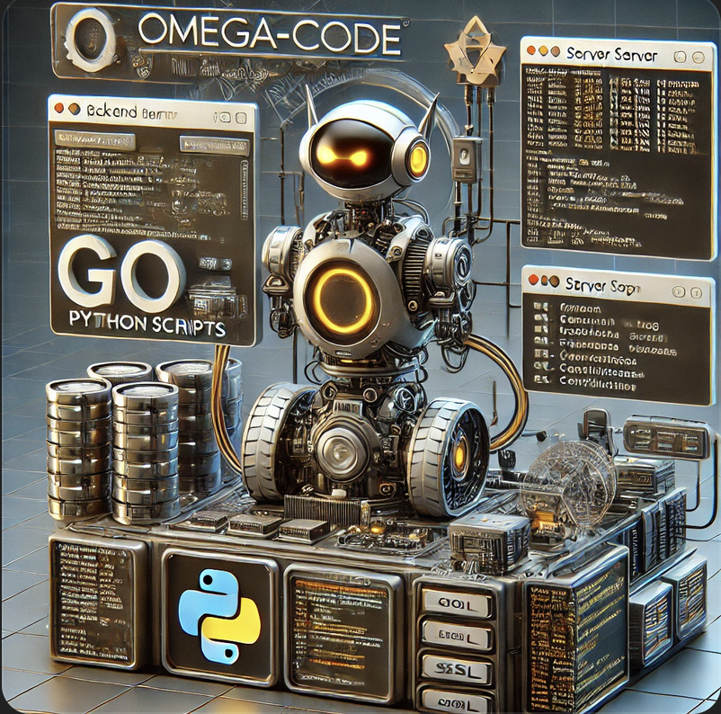

# Robot Controller Backend

This project is the backend server for the Omega-Code robot controller. Written in Go and Python, it handles incoming HTTP requests to control the robot's movements, speed, servos, and LED lights.



## Project Structure

The project is organized into several directories and files:

- **certs**: Contains SSL certificates for secure communication.
- **commands**: Command definitions and processors.
- **gpio**: GPIO handling code.
- **sensors**: Sensor interfacing code.
- **controllers**: Controllers for motors, servos, and line tracking.
- **video**: Video streaming server.
- **utils**: Utility scripts and helper classes.
- **tests**: Unit tests.
- **rust_module**: Rust integration for performance-critical tasks.
- **__pycache__**: Python bytecode cache.
- **venv**: Python virtual environment for dependencies.
- **main.go**: Entry point of the backend server (Go).
- **main.py**: Entry point of the backend server (Python).
- **server.csr**: Certificate Signing Request file.
- **server.log**: Log file for server activities.
- **go.mod**: Go module definitions.
- **go.sum**: Go module dependencies.

## Key Files

### PCA9685

- **PCA9685 Control**: `utils/PCA9685.py` - Controls the PCA9685 PWM driver.
- **Mock PCA9685**: `utils/mock_pca9685.py` - Mock implementation of PCA9685 for testing.

### LED Control

- **LED Control**: `utils/led_control.py` - Manages the LED lights on the robot.

### Servo Control

- **Servo Control**: `controllers/servo_control.py` - Controls the servo motors.

### ADC

- **ADC**: `sensors/adc.py` - Handles analog to digital conversion.

### Line Tracking

- **Line Tracking**: `controllers/line_tracking.py` - Manages the line tracking functionality.

### Threading Control

- **Threading Control**: `utils/threading_control.py` - Manages threading for concurrent tasks.

### Ultrasonic Sensor

- **Ultrasonic Sensor**: `sensors/ultrasonic_sensor.py` - Controls the ultrasonic sensor for distance measurement.
- **Ultrasonic Sensor (Go)**: `sensors/ultrasonic_sensor.go` - Handles ultrasonic sensor integration in Go.

### Command Definitions

- **Command Definitions**: `command_definitions.py` - Defines commands for the robot.
- **Command Processor**: `commands/command_processor.py` - Processes incoming commands.

### Video Server

- **Video Server**: `video/video_server.py` - Handles video streaming from the robot.

## Getting Started

### Prerequisites

- Go
- Python

### Installation

1. Install Go dependencies:

   ```bash
   go get ./...
   ```
2. Set up Python virtual environment:

   ```bash
   python3 -m venv venv
   source venv/bin/activate
   pip install -r requirements.txt
   ```
3. Set up environment variables:
   Create a `.env` file in the root directory with the following variables:

   ```env
   CERT_PATH=/path/to/cert.pem
   KEY_PATH=/path/to/key.pem
   ```

### Running the Project

1. Start the backend server (Go):

   ```bash
   go run main.go
   ```
2. Start the backend server (Python):

   ```bash
   python main.py
   ```

### Usage

The backend server will listen for incoming HTTP requests to control the robot. Ensure the frontend is running to interact with the backend.

## Testing

This project includes a comprehensive test suite to ensure the functionality of the backend components.

### Test Structure

The tests are located in the `tests` directory and are organized as follows:

- `led_control_test.py`: Tests for the LED control functionality.
- `mock_pca9685_test.py`: Tests for the mock PCA9685 functionality.
- `servo_control_test.py`: Tests for the servo control functionality.

### Running Tests

To run the tests, follow these steps:

* Ensure you have all dependencies installed. You can install them using the provided `requirements.txt` file.

  ```bash
  pip install -r requirements.txt
  ```
* Set the PYTHONPATH to the current directory and run pytest.

  ```
  export PYTHONPATH=$(pwd)
  pytest
  ```

======================= test session starts =======================
platform darwin -- Python 3.10.8, pytest-8.2.2, pluggy-1.5.0
rootdir: /Users/abel_elreaper/Desktop/Omega-Code/servers/robot-controller-backend
plugins: mock-3.14.0
collected 11 items

tests/led_control_test.py ......                            [ 54%]
tests/mock_pca9685_test.py ..                               [ 72%]
tests/servo_control_test.py ...                             [100%]

================== 11 passed in 295.62s (0:04:55) ==================

### CI/CD Integration

The tests are automatically run on each push to the master branch and on each pull request targeting the master branch using GitHub Actions. The CI/CD configuration can be found in the `.github/workflows/ci.yml` file.

### Test Descriptions

- **led_control_test.py**: Tests for the LED control functionality.

  - `test_color_wipe`: Tests the color wipe functionality.
  - `test_theater_chase`: Tests the theater chase functionality.
  - `test_rainbow`: Tests the rainbow functionality.
  - `test_set_led_single`: Tests setting a single LED.
  - `test_set_led_multi`: Tests setting multiple LEDs.
  - `test_set_led_two`: Tests setting two LEDs.
- **mock_pca9685_test.py**: Tests for the mock PCA9685 functionality.

  - `test_set_pwm_freq`: Tests setting the PWM frequency.
  - `test_set_servo_pulse`: Tests setting the servo pulse.
- **servo_control_test.py**: Tests for the servo control functionality.

  - `test_servo_initialization`: Tests the initialization of the servo.
  - `test_set_servo_pwm_horizontal`: Tests setting the PWM for the horizontal servo.
  - `test_set_servo_pwm_vertical`: Tests setting the PWM for the vertical servo.


## Contributing

Contributions are welcome! Please fork the repository and submit a pull request for any improvements or bug fixes.

## License

This project is licensed under the MIT License.
