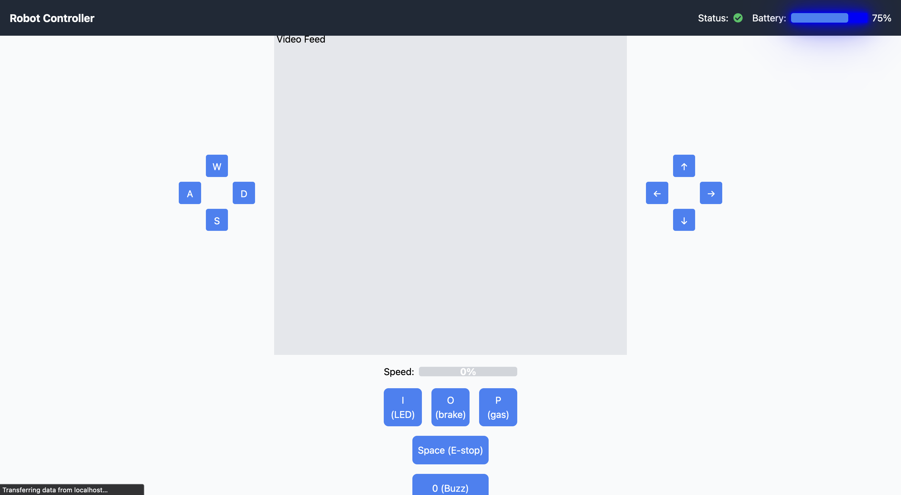
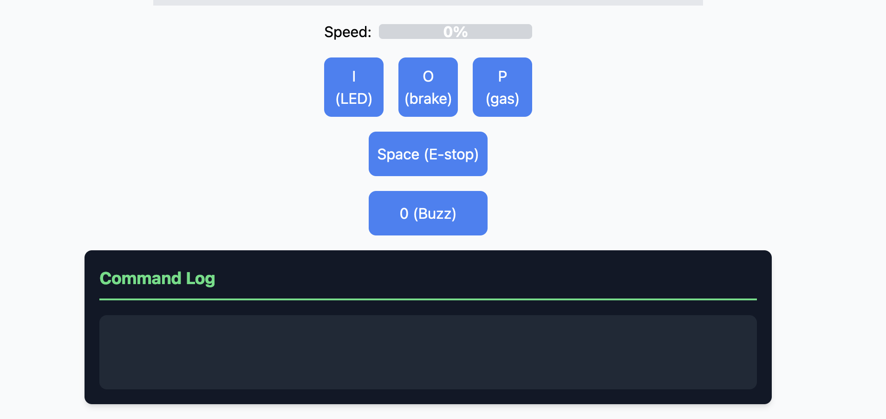
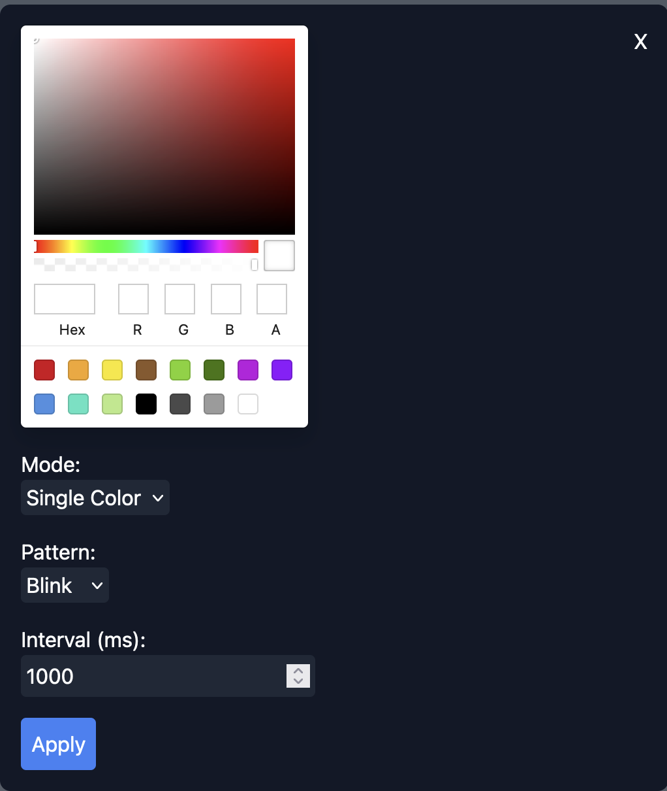

# Robot Controller UI

This project is the frontend user interface for the Omega-Code robot controller. Built with Next.js and React, it provides a web-based interface for controlling the robot's movements, camera, and LED lights.


## Project Structure

The project is organized into several directories:

- **components**: Contains all the React components used in the UI.
- **pages**: Contains the Next.js pages.
- **styles**: Contains global CSS styles.
- **control_definitions.ts**: Contains command definitions used throughout the project.







#### LED Modal




# Components

### Home

- **Main Page**: `src/pages/index.tsx` - Main page integrating all components.

### Command Log Context

- **Context for Logging Commands**: `src/components/CommandLogContext.tsx`

### Control Panel

- **Car Control Panel**: `src/components/CarControlPanel.tsx` - Component for controlling robot movements.

### Speed Control

- **Speed Control**: `src/components/SpeedControl.tsx` - Component for controlling robot speed.

### LED Control

- **LED Control**: `src/components/LedControl.tsx` - Component for controlling LED lights.

### Video Feed

- **Video Feed**: `src/components/VideoFeed.tsx` - Component for displaying video feed.

### Status and Header

- **Header**: `src/components/Header.tsx` - Displays connection status and battery level.
- **Status**: `src/components/Status.tsx` - Displays connection status and battery level.

### LED Modal

- **LED Modal**: `src/components/LedModal.tsx` - Modal for configuring LED settings.

### Lighting Settings

- **Lighting Pattern**: `src/components/LightingPattern.tsx` - Selects lighting patterns.
- **Lighting Mode**: `src/components/LightingMode.tsx` - Selects lighting modes.
- **Interval Timing**: `src/components/IntervalTiming.tsx` - Sets interval timing for LED patterns.

### Control Buttons

- **Control Buttons**: `src/components/ControlButtons.tsx` - Start, stop, and apply settings buttons.

### Color Selection

- **Color Wheel**: `src/components/ColorWheel.tsx` - Color selection using a color wheel.

### Additional Components

- **Sensor Dashboard**: `src/components/SensorDashboard.tsx` - Displays sensor readings in a unified view.
- **Gps Location**: `src/components/GpsLocation.tsx` - Shows the robot's GPS coordinates.
- **Map Component**: `src/components/MapComponent.tsx` - Renders a map for location tracking.
- **Line Tracker Status**: `src/components/LineTrackerStatus.tsx` - Indicates line tracking sensor status.
- **Ultrasonic Sensor Status**: `src/components/UltrasonicSensorStatus.tsx` - Shows distance measurements from the ultrasonic sensor.

## Styles

- **Global Styles**: `src/styles/globals.css` - Global CSS styles for the project.

## Redux Store

- The Redux logic lives in `src/redux` and is initialized in `src/redux/store.ts`.

## Getting Started

### Prerequisites

- Node.js

### Installation

1. Install frontend dependencies:

   ```bash
   npm install
   ```
2. Set up environment variables:
   Create a `.env.local` file in the root directory with any necessary environment variables.

### Running the Project

1. Start the development server:
   ```bash
   npm run dev
   ```

### Usage

Open a web browser and navigate to `http://localhost:3000` to access the robot controller interface. Use the provided controls to send commands to the robot.

## Testing

Unit tests are written with Jest and located in the `tests` directory. End-to-end tests use Cypress and are found in the `cypress` folder.

## Contributing

Contributions are welcome! Please fork the repository and submit a pull request for any improvements or bug fixes.

## License

This project is licensed under the MIT License.
